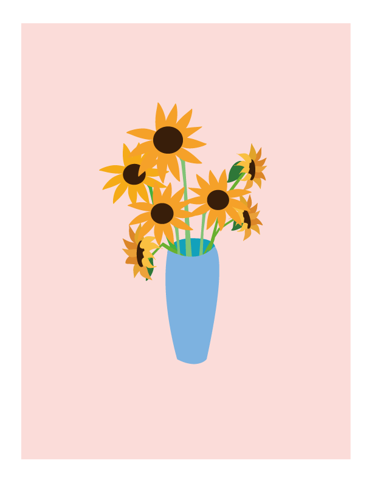

 

<main>
    

        <h1 class="hello_title">Hi! I am Dingyu</h1>
        <h2>Your Future Web & Graphic Designer</h2>
        

        <h2><a href="/about.html">Get Know More About Me --></a></h2>
    

<h1 class="mywork_title" > Some of My Work</h1>
    

        <h1 class="card1title">Free sunflowers</h1>
        
 

        

        
Sunflowers represent positive attitudes to a better life. 
            This is my graphic design, sunflower in the bottle. The pink background makes the picture more soft, 
            sunflower, growing in different directions. 
            Blue bottle and pink background form a soft contrast.

        
<a href="/work.html#graphic">More about my work--></a>

        

    

       

        <h1 class="card1title">Study Project</h1>
        
<iframe width="560" height="315" src="https://www.youtube.com/embed/4KHJGOJLS5M" title="YouTube video player" frameborder="0" allow="accelerometer; autoplay; clipboard-write; encrypted-media; gyroscope; picture-in-picture" allowfullscreen></iframe> 

        

        
This part mainly demonstrates this semester learning project, such as UI and UX's initial learning. 

        
<a href="/work.html#study">More about my work--></a>

        

    

         

            

            

          

         

<h1 class="contactme">Contact Me</h1>
            <h2 class="media">Instagram:@dingfish_w</h2>
            <h2 class="media">Facebook:dingyu.wang</h2>
            <h2 class="media">Email: Dingyuwang0102@gmail.com</h2>
         
  

</main>
    

